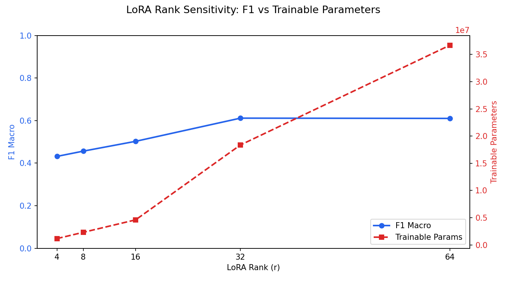

# PEFT Regime Benchmark


[](https://wandb.ai/swaratsarkar-university-at-buffalo/peft-regime-benchmark)

A rigorous benchmark comparing **LoRA, QLoRA, Prefix Tuning, and (IA)³** fine-tuning methods on **market regime detection** — classifying financial text (Fed statements, earnings calls, macro news) as **Bull**, **Bear**, or **Volatile**.

The key novel contribution is the **Regime Confidence Score**: a custom metric that penalizes high-confidence wrong predictions with financial severity weighting (Bull↔Bear errors penalized 2× more than adjacent errors).

---

## The Problem

Misclassifying market regimes has asymmetric consequences. Calling a Bear market **Bull** (opposite direction) is catastrophically more dangerous than calling it **Volatile** (adjacent). Standard accuracy and F1 metrics treat all errors equally — our Regime Confidence Score reflects the real financial cost of confident mistakes.

---

## Architecture

### PEFT Methods Compared

| Method | Key Config | Trainable Params |
|---|---|---|
| LoRA | r=16, α=32, fp4 quant | 4,596,736 |
| QLoRA | r=16, α=32, nf4 + double quant | 4,596,736 |
| Prefix Tuning | 10 virtual tokens | 582,656 |
| (IA)³ | learned input/output scaling vectors | 295,936 |

**Base model:** Llama-3.2-3B (4-bit quantized, GTX 1650 / 4GB VRAM)  
**Dataset:** FinancialPhraseBank → regime-relabeled (Bull/Bear/Volatile)

### Regime Confidence Score

For each wrong prediction:
```
penalty = confidence × severity_weight
severity: Bull↔Bear = 2.0×,  Bull↔Volatile or Bear↔Volatile = 1.0×
score = 1.0 - Σ(penalties) / (N × 2.0)   ∈ [0, 1]
```

Higher is better. A score of 1.0 means all predictions were correct. A model that is confidently wrong on opposite-direction regime errors scores much lower than one that hedges toward adjacent classes.

---

## Benchmark Results

**Llama-3.2-3B · FinancialPhraseBank test set**

| Method | Accuracy | F1 Macro | Bull F1 | Bear F1 | Volatile F1 | RCS | Trainable Params |
|---|---|---|---|---|---|---|---|
| **QLoRA** | **90.0%** | **90.8%** | 90.5% | **94.5%** | 87.5% | **0.957** | 4,596,736 |
| LoRA | 87.8% | 88.9% | 88.1% | 93.4% | 85.0% | 0.951 | 4,596,736 |
| **(IA)³** | 87.0% | 87.6% | **88.2%** | 90.3% | 84.2% | 0.942 | **295,936** |
| Prefix Tuning | 44.1% | 33.7% | — | — | — | — | 582,656 |

*RCS = Regime Confidence Score*

**Prefix Tuning failed** due to incompatibility between 4-bit quantization and Llama-3.2's DynamicCache architecture — it could not generalize beyond majority-class prediction.

---

## LoRA Rank Sensitivity

F1 Macro and trainable parameter count as a function of LoRA rank (30 training steps each, showing relative trend):



| LoRA Rank (r) | F1 Macro | RCS | Trainable Params |
|---|---|---|---|
| 4 | 0.4318 | 0.8006 | 1,156,096 |
| 8 | 0.4564 | 0.8002 | 2,302,976 |
| 16 | 0.5026 | 0.8173 | 4,596,736 |
| **32** | **0.6115** | **0.8520** | 18,359,296 |
| 64 | 0.6103 | 0.8547 | 36,709,376 |

**r=32 is the crossover point** — F1 peaks then falls at r=64 despite 2× the parameters.

---

## Key Findings

- **QLoRA outperforms LoRA** (90.8% vs 88.9% F1) despite identical parameter counts — nf4 quantization with double quantization consistently produces better representations than fp4 on this task.
- **(IA)³ is the efficiency winner** — 87.6% F1 with only 295,936 trainable parameters (~15× fewer than LoRA/QLoRA), making it the best choice when compute is the bottleneck.
- **Bear regime is easiest to detect** across all methods (F1 ~90–94%); Volatile is hardest (~84–87%), reflecting real-world ambiguity in mixed-signal markets.
- **LoRA rank sweet spot is r=32** — gains plateau and slightly reverse at r=64, suggesting diminishing returns at very high ranks for this dataset size.

---

## Reproduction

```bash
# 1. Clone and set up environment
git clone https://github.com/swarat17/market-regime-detection.git
cd market-regime-detection

# 2. Install PyTorch with CUDA (do this first)
pip install torch==2.4.1 --index-url https://download.pytorch.org/whl/cu121

# 3. Install remaining dependencies
pip install -r requirements.txt

# 4. Authenticate
huggingface-cli login   # required for Llama-3.2-3B (gated model)
wandb login

# 5. Train a single method (runs on a 4GB GPU in ~15h with 4-bit quant)
python scripts/train.py --method qlora --base-model llama3 --seed 42

# 6. Evaluate all checkpoints
python scripts/evaluate.py --auto-discover

# 7. Run LoRA rank sensitivity sweep (~8h with --max-steps 30)
python scripts/rank_sensitivity.py --max-steps 30

# 8. Launch the Gradio demo
python frontend/app.py
```

Runs under **~$5 compute cost** using 4-bit QLoRA on a consumer GPU (tested on GTX 1650 4GB).

---

## Project Structure

```
├── configs/           # YAML configs for each PEFT method
├── src/
│   ├── data/          # FPB loader, regime labeling, stratified splits
│   ├── models/        # Base model loader, PEFT factory
│   ├── training/      # Trainer, W&B callbacks
│   └── evaluation/    # Custom metrics, evaluator, benchmark runner
├── scripts/           # train.py, evaluate.py, rank_sensitivity.py
├── frontend/          # Gradio app (Tab 1: classifier, Tab 2: benchmark results)
└── tests/             # 22 unit tests across all phases
```

---

## Stack

HuggingFace PEFT · bitsandbytes · Transformers · Weights & Biases · Llama-3.2-3B · Gradio · GitHub Actions
